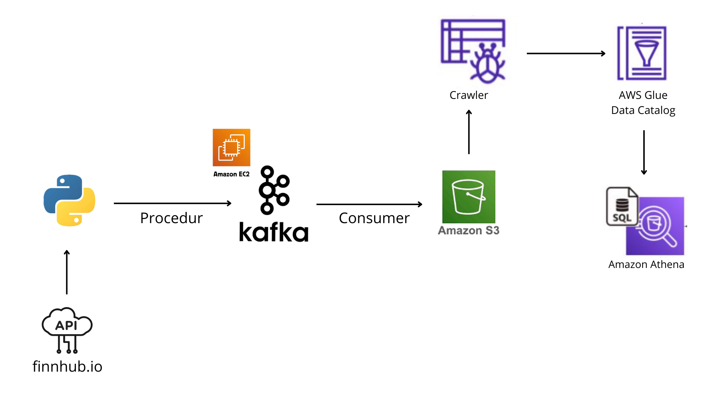

# Real-time Stock Market Streaming using Kafka & AWS 
## Project Overview
This project builds a real-time data streaming pipeline using Apache Kafka running on Amazon EC2, with live stock market data streamed from the Finnhub WebSocket API.
The pipeline works as follows:

1. Producer receives real-time stock price updates from Finnhub WebSocket.
2. Producer publishes the data to Kafka on EC2.
3. Consumer reads the Kafka messages and writes them as Parquet files to Amazon S3.
4. Amazon Athena is used to query and analyze the data using SQL.

This architecture mimics an industry-standard setup for:
* Real-time analytics
* Market data processing
* Event-driven systems

## Architecture


## Data Source: Finnhub API
This project uses <b>Finnhub WebSocket API</b> to stream real-time stock market data.
<br>Example message format:
```
{
  "c": ["1", "8"],
  "p": 415.89,
  "s": "TSLA",
  "t": 1763997374633,
  "v": 40
}
```
Where:
| Field | Meaning                                                  |
| ----- | -------------------------------------------------------- |
| **c** | Trade conditions (e.g., 1 = Regular Sale, 8 = Cancelled) |
| **p** | Trade price                                              |
| **s** | Stock symbol                                             |
| **t** | Unix timestamp (ms)                                      |
| **v** | Trade volume                                             |

## Kafka Setup on Amazon EC2
### 1. Download & Extract Kafka
```
wget https://downloads.apache.org/kafka/3.8.0/kafka_2.13-3.8.0.tgz
tar -xvf kafka_2.13-3.8.0.tgz
````

### 2. Install Java
Check Java version:
```
java -version
```
If Java is not installed:
```
sudo yum install java-1.8.0-openjdk
java -version
```
Go to Kafka folder:
```
cd kafka_2.13-3.8.0
```
### 3. Start ZooKeeper
```
bin/zookeeper-server-start.sh config/zookeeper.properties
```
### 4. Start Kafka Server
Open a new SSH session:
```
export KAFKA_HEAP_OPTS="-Xmx256M -Xms128M"
cd kafka_2.13-3.8.0
bin/kafka-server-start.sh config/server.properties
```
#### Update Kafka server.properties
Kafka needs your EC2 public IP:
```
sudo nano config/server.properties
```
Find and update:
```
advertised.listeners=PLAINTEXT://<YOUR-EC2-PUBLIC-IP>:9092
```
Save & exit.
### 5. Create Kafka Topic
Open a new SSH session:
```
cd kafka_2.13-3.8.0
bin/kafka-topics.sh --create --topic kafka_finnhub \
--bootstrap-server <EC2-PUBLIC-IP>:9092 \
--replication-factor 1 --partitions 1
```
### 6. Start Kafka Producer
```
bin/kafka-console-producer.sh --topic kafka_finnhub --bootstrap-server <EC2-PUBLIC-IP>:9092
```
### 7. Start Kafka Consumer
Open a new SSH session:
```
cd kafka_2.13-3.8.0
bin/kafka-console-consumer.sh --topic kafka_finnhub --bootstrap-server <EC2-PUBLIC-IP>:9092
```
## Conclusion
This project demonstrates how to build a real-time streaming data pipeline using Kafka on EC2, integrate it with cloud storage (S3), and perform analytics using Athena. Perfect for data engineering portfolios and real-time data processing case studies.